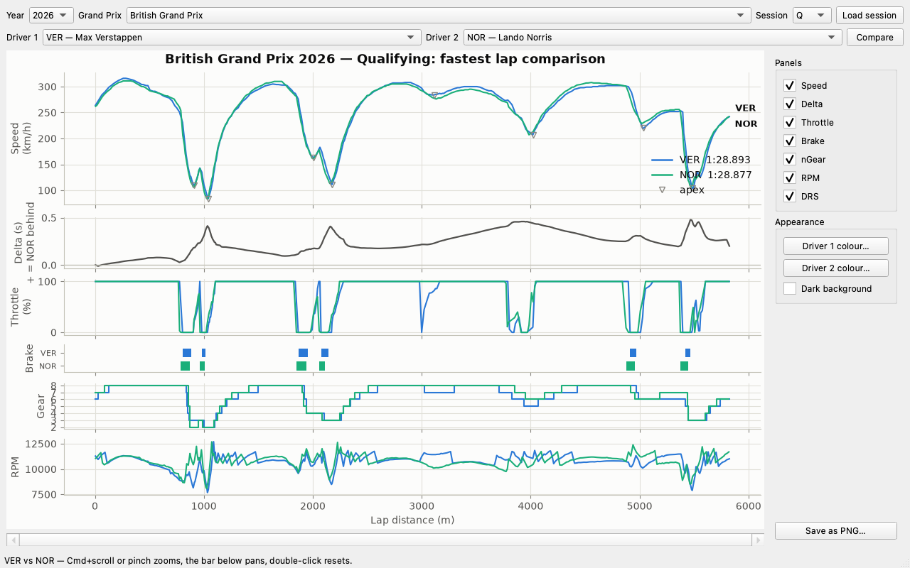

# f1-telemetry-lab

[](https://github.com/Oguz-Celikel/f1-telemetry-lab/actions/workflows/ci.yml)
[](LICENSE)

Compare two Formula 1 drivers' fastest laps and see exactly where the time was
won and lost. Telemetry comes from [FastF1](https://docs.fastf1.dev/); the
analysis runs on a native C++ engine, with a numpy fallback when no compiler is
available.

## The app



Pick a season, a Grand Prix, a session and two drivers — the app downloads the
telemetry and embeds the comparison in the window. Every list is real:
choosing a season fills the calendar, loading a session fills the driver lists
with the people who actually raced in it, so 2020 offers the 2020 grid.
Downloads run off the UI thread; the window never freezes.

The controls on the right shape the figure live: choose which channels to
show, recolour either driver, switch to a dark background (its own validated
palette, not an inversion), and save the result as a PNG.

The figure reads top to bottom: the time delta first (the answer), then every
channel the cars recorded — speed with detected corner apexes marked,
throttle, brake, gear, RPM — sharing one distance axis, so a swing in the
delta lines up vertically with the inputs that caused it. In the session
above, Norris took pole by 0.016 s: Verstappen gains under braking into
Village and Vale, Norris pulls it back through the fast Maggotts–Becketts
sweeps. Channels that carry no signal are dropped — 2026 cars have no DRS
(active aerodynamics replaced it), so that panel only appears for older
seasons.

### Install

Grab `F1-Telemetry-Lab.dmg` from the
[latest release](https://github.com/Oguz-Celikel/f1-telemetry-lab/releases/latest),
open it and drag **F1 Telemetry Lab** to Applications. On first launch macOS
warns that the app is from an unidentified developer (it is not notarised —
that requires a paid Apple Developer account): right-click the app, choose
**Open**, and confirm once.

Good to know:

- The first load of any session downloads tens of megabytes of telemetry; it
  is cached under `~/Library/Application Support/F1 Telemetry Lab/` and is
  fast from then on.
- Logs live in `~/Library/Logs/F1 Telemetry Lab/` — the place to look if
  something misbehaves.
- The window title shows the version you are running.

## Running from a checkout

Prerequisites: [Docker Desktop](https://www.docker.com/products/docker-desktop/)
for the analysis tasks, [`just`](https://github.com/casey/just) as the task
runner, Python 3.12+ for the app and the local virtualenv.

```sh
git clone https://github.com/Oguz-Celikel/f1-telemetry-lab.git
cd f1-telemetry-lab

just init && just dependencies   # local virtualenv (also compiles the C++ engine)
just gui                         # the desktop app, from source

just build                            # Docker image for the CLI and the tests
just run 2026 Silverstone Q VER NOR   # the same comparison as a PNG in output/
```

The desktop app is an optional extra (`pip install "f1lab[gui]"`) — the engine
and the CLI stay installable on a headless machine that has no use for Qt.

## Running other comparisons

Any season, Grand Prix, session and driver pairing that FastF1 covers works:

```sh
just examples   # prints ready-to-copy commands
```

```sh
just run 2026 Silverstone R VER NOR    # race instead of qualifying
just run 2026 Monza Q LEC PIA          # different circuit and drivers
just run 2026 Spa Q HAM RUS            # teammate comparison
just run 2025 Suzuka R VER ALO         # earlier seasons
just run 2026 "Abu Dhabi" Q ALO STR    # quote names containing spaces
```

Arguments are `year gp [session] [driver1] [driver2]`; session defaults to `R`
and accepts `R`, `Q`, `S` (sprint) and `FP1`/`FP2`/`FP3`. Drivers are the usual
three-letter codes.

## Commands

| Command | What it does | Runs in |
|---------|--------------|---------|
| `just run …` | Fastest-lap comparison plot | Docker |
| `just gui` | Launch the desktop app | host |
| `just app` | Build `dist/F1 Telemetry Lab.app` | host |
| `just dmg` | Package the app into a disk image | host |
| `just examples` | Print example `just run` commands | host |
| `just build` | Build the Docker image | Docker |
| `just test` | Python tests (pytest) and C++ tests (Catch2) | Docker |
| `just lint` | ruff and mypy | Docker |
| `just bench` | numpy vs C++ engine benchmark table | Docker |
| `just init` | Create `.venv`, `output/`, `.fastf1-cache/` | host |
| `just dependencies` | Editable install of `f1lab[dev]` into `.venv` | host |
| `just package` | Build a wheel into `dist/` | host |
| `just clean` | Remove caches and generated plots (keeps the FastF1 cache) | host |

Run `just` on its own to list them.

## Troubleshooting

**"Docker is not running."** Start Docker Desktop (`open -a Docker` on macOS)
and give it around twenty seconds, then re-run the command.

**The first run takes minutes.** That is the FastF1 download. Subsequent runs on
the same session read from `.fastf1-cache/` and finish in seconds.

**"No valid fastest lap found for driver X".** That driver set no timed lap in
the session — check the three-letter code and the session, or try another
pairing.

## What's inside

```
f1-telemetry-lab/
├── src/f1lab/    the Python package: FastF1 loading, plotting, CLI, and the
│                 numpy reference implementation of every calculation
├── cpp/          the native engine: the same calculations in C++, compiled
│                 into the package as f1lab._native (CMake + pybind11)
├── tests/        pytest suite, including tests that the two engines agree
├── docker/       the image the tasks run in
└── output/       generated plots
```

Both halves have their own README with the design decisions behind them:
[src/f1lab/README.md](src/f1lab/README.md) for the Python package and engine
dispatch, [cpp/README.md](cpp/README.md) for the C++ core and how it is built.

## Continuous integration

Every push runs four jobs on GitHub Actions, directly on the runner rather than
in the project's Docker image — which also proves the package builds outside the
one environment it was developed in:

- **Lint** — ruff and mypy.
- **Python 3.12 and 3.14** — installs the package (compiling the C++ engine),
  confirms the native engine is the one selected, then runs the full suite
  including the parity tests, with a coverage floor.
- **numpy fallback** — deletes the compiled extension from the installed
  package to simulate a machine with no C++ toolchain, confirms the engine
  falls back to numpy, and runs the suite again. The README's fallback promise
  is tested here rather than assumed.
- **C++** — builds the core as a standalone CMake project, with no Python
  present, and runs the Catch2 suite under ctest.

Coverage is 99% with the native engine and 93% on the fallback path, enforced
as a floor in both jobs and reported per file on the run's summary page.
`just coverage` produces the same report locally as a clickable HTML page under
`output/coverage/`.

What the remaining lines are, and why they stay uncovered: `load_session` is a
three-line wrapper around a FastF1 network call, and mocking it would test the
mock; the `RuntimeError` raised when `engine="cpp"` is requested without the
extension cannot be reached in a job where the extension exists — the fallback
job covers it.

## Roadmap

Done: the analysis lab, the native C++ engine, CI, the multi-panel telemetry
view, and the desktop app. Next: championship standings in the app (via the
jolpica API), and a track map coloured by which driver is quicker in each
segment.

## Data and acknowledgements

All telemetry is loaded through [FastF1](https://github.com/theOehrly/Fast-F1),
which reads the official F1 live-timing service for car data and the
[jolpica-f1](https://github.com/jolpica/jolpica-f1) API — the community-run
successor to Ergast — for schedule and results metadata. This project only
analyses and plots what those provide; it collects no data of its own. Thanks to
the maintainers of both.

FastF1 and this project are unofficial and are not associated in any way with
the Formula 1 companies. F1, FORMULA ONE, FORMULA 1, FIA FORMULA ONE WORLD
CHAMPIONSHIP, GRAND PRIX and related marks are trade marks of Formula One
Licensing B.V.

## License

[MIT](LICENSE)
