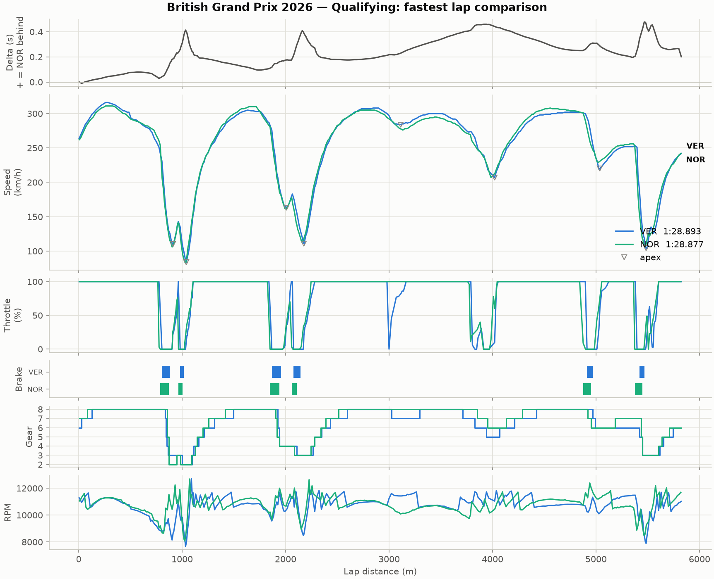

# f1-telemetry-lab

[](https://github.com/Oguz-Celikel/f1-telemetry-lab/actions/workflows/ci.yml)
[](LICENSE)

Compare two Formula 1 drivers' fastest laps and see exactly where the time was
won and lost. Telemetry comes from [FastF1](https://docs.fastf1.dev/); the
analysis runs on a native C++ engine, with a numpy fallback when no compiler is
available.

## What you get

One command:

```sh
just run 2026 Silverstone Q VER NOR
```

writes a PNG to `output/` — the time delta on top, then every telemetry channel
the cars recorded (speed with corner apexes marked, throttle, brake, gear and
RPM), all sharing one distance axis:



Reading this one: Norris took pole by 0.016 s. The delta panel shows Verstappen
gaining under braking into Village (around 1000 m) and Vale (5400 m), while
Norris pulls it back through the fast Maggotts–Becketts sweeps — by 4000 m he is
0.45 s up. Because every channel lines up vertically, the throttle and brake
panels show *why*: same corner, the two drivers lift and brake at slightly
different points. (There is no DRS panel here — 2026 cars replaced it with
active aerodynamics, so the channel is flat and the panel is dropped; on a 2024
session it appears.)

## Requirements

- [Docker Desktop](https://www.docker.com/products/docker-desktop/) — every
  heavy task runs in a container, so nothing but Docker has to be installed for
  the analysis itself.
- [`just`](https://github.com/casey/just) — the task runner (`brew install just`).
- Python 3.12+ — only for the optional local virtualenv that your editor uses.

## Getting started

```sh
git clone https://github.com/Oguz-Celikel/f1-telemetry-lab.git
cd f1-telemetry-lab

just build                            # build the Docker image (compiles the C++ engine)
just run 2026 Silverstone Q VER NOR   # produce the comparison plot
```

The path of the generated PNG is printed at the end of the run. The first run of
any session is slow — FastF1 downloads tens of megabytes of telemetry — but the
data is cached in `.fastf1-cache/` and reused from then on.

To work on the code rather than just run it, add a local virtualenv so your
editor gets autocompletion and type checking:

```sh
just init          # create .venv, output/ and .fastf1-cache/
just dependencies  # install f1lab[dev] into .venv (also builds the C++ engine locally)
```

## Running other comparisons

Any season, Grand Prix, session and driver pairing that FastF1 covers works:

```sh
just examples   # prints ready-to-copy commands
```

```sh
just run 2026 Silverstone R VER NOR    # race instead of qualifying
just run 2026 Monza Q LEC PIA          # different circuit and drivers
just run 2026 Spa Q HAM RUS            # teammate comparison
just run 2025 Suzuka R VER ALO         # earlier seasons
just run 2026 "Abu Dhabi" Q ALO STR    # quote names containing spaces
```

Arguments are `year gp [session] [driver1] [driver2]`; session defaults to `R`
and accepts `R`, `Q`, `S` (sprint) and `FP1`/`FP2`/`FP3`. Drivers are the usual
three-letter codes.

## Commands

| Command | What it does | Runs in |
|---------|--------------|---------|
| `just run …` | Fastest-lap comparison plot | Docker |
| `just examples` | Print example `just run` commands | host |
| `just build` | Build the Docker image | Docker |
| `just test` | Python tests (pytest) and C++ tests (Catch2) | Docker |
| `just lint` | ruff and mypy | Docker |
| `just bench` | numpy vs C++ engine benchmark table | Docker |
| `just init` | Create `.venv`, `output/`, `.fastf1-cache/` | host |
| `just dependencies` | Editable install of `f1lab[dev]` into `.venv` | host |
| `just package` | Build a wheel into `dist/` | host |
| `just clean` | Remove caches and generated plots (keeps the FastF1 cache) | host |

Run `just` on its own to list them.

## Troubleshooting

**"Docker is not running."** Start Docker Desktop (`open -a Docker` on macOS)
and give it around twenty seconds, then re-run the command.

**The first run takes minutes.** That is the FastF1 download. Subsequent runs on
the same session read from `.fastf1-cache/` and finish in seconds.

**"No valid fastest lap found for driver X".** That driver set no timed lap in
the session — check the three-letter code and the session, or try another
pairing.

## What's inside

```
f1-telemetry-lab/
├── src/f1lab/    the Python package: FastF1 loading, plotting, CLI, and the
│                 numpy reference implementation of every calculation
├── cpp/          the native engine: the same calculations in C++, compiled
│                 into the package as f1lab._native (CMake + pybind11)
├── tests/        pytest suite, including tests that the two engines agree
├── docker/       the image the tasks run in
└── output/       generated plots
```

Both halves have their own README with the design decisions behind them:
[src/f1lab/README.md](src/f1lab/README.md) for the Python package and engine
dispatch, [cpp/README.md](cpp/README.md) for the C++ core and how it is built.

## Continuous integration

Every push runs four jobs on GitHub Actions, directly on the runner rather than
in the project's Docker image — which also proves the package builds outside the
one environment it was developed in:

- **Lint** — ruff and mypy.
- **Python 3.12 and 3.14** — installs the package (compiling the C++ engine),
  confirms the native engine is the one selected, then runs the full suite
  including the parity tests, with a coverage floor.
- **numpy fallback** — deletes the compiled extension from the installed
  package to simulate a machine with no C++ toolchain, confirms the engine
  falls back to numpy, and runs the suite again. The README's fallback promise
  is tested here rather than assumed.
- **C++** — builds the core as a standalone CMake project, with no Python
  present, and runs the Catch2 suite under ctest.

Coverage is 99% with the native engine and 93% on the fallback path, enforced
as a floor in both jobs and reported per file on the run's summary page.
`just coverage` produces the same report locally as a clickable HTML page under
`output/coverage/`.

What the remaining lines are, and why they stay uncovered: `load_session` is a
three-line wrapper around a FastF1 network call, and mocking it would test the
mock; the `RuntimeError` raised when `engine="cpp"` is requested without the
extension cannot be reached in a job where the extension exists — the fallback
job covers it.

## Roadmap

Done: the analysis lab, the native C++ engine, and CI. Next: a multi-panel view
adding throttle, brake, gear and DRS traces, and a track map coloured by which
driver is quicker in each segment.

## Notes

Unofficial project, not associated with Formula 1. Telemetry is fetched through
FastF1's public sources.

## License

[MIT](LICENSE)
